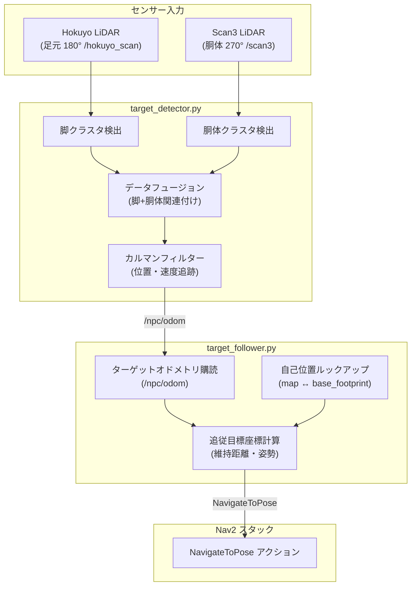
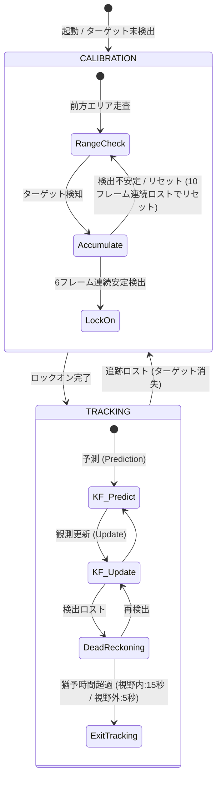

# Sirius Navigation - ターゲット追跡・追従システム (Target Tracking & Following System)

本システムは、LiDAR（2Dレーザースキャン）データから特定のターゲット（人間・NPCなど）をリアルタイムに検出し、一定の距離を保ちながら自動で追従（フォロー）するための機能を提供します。

---

## システム構成

本システムは大きく分けて **検出ノード (`target_detector`)** と **追従ノード (`target_follower`)** の2つの独立したROS 2ノードから構成されています。



---

## 1. ターゲット検出ノード (`target_detector.py`)

足元の LiDAR（脚）と腰の高さの LiDAR（胴体）のデータを組み合わせてターゲットの正確なグローバル位置を推定し、**カルマンフィルター (Kalman Filter)** で滑らかに追跡します。

### 状態遷移（ステートマシン）



### 主要パラメータ (`params/` 内で設定可能)

| パラメータ名 | デフォルト値 | 説明 |
| :--- | :--- | :--- |
| `lockon_max_range` | **`1.0m`** | キャリブレーション時にロックオンを受け入れる前方の最大距離。 |
| `lockon_max_lateral` | **`0.8m`** | キャリブレーション時に受け入れる左右の最大ズレ幅（±80cm）。 |
| `calib_miss_tolerance` | **`10`** | キャリブレーション中の検出漏れ許容数（10フレーム/約1秒）。超えるとカウントリセット。 |
| `gating_distance` | **`0.6m`** | 追従中のカルマンフィルター関連付けゲート。静的オブジェクト（柱など）への吸い付きを防止。 |
| `active_fov_deg` | **`270.0`** | 追従中の有効視野角。270度に広げることで、ロボットの真横や斜め後方の回り込みに対応。 |

> [!NOTE]
> **側面に回り込んだときの挙動 (センサーロバスト性)**
> 足元の `hokuyo_scan`（視野180度）からターゲットの脚が物理的に見えなくなった場合（`has_matching_leg = False`）でも、`scan3`（視野270度）が胴体を捉えていれば、ペナルティ加算 `+1.2` だけで追跡が継続されます。

---

## 2. ターゲット追従ノード (`target_follower.py`)

検出されたターゲット位置（`/npc/odom`）を元に、ロボットが一定の距離を維持して追尾するためのゴール指令を Nav2 に送信します。

### 動作フロー

1. **自己位置の取得**: TF を用いてロボットの現在のグローバル座標 (`map` 基準の `base_footprint`) を取得。
2. **目標位置の算出**: ターゲットの座標から、あらかじめ設定された `follow_distance`（維持距離）分だけ手前の座標を算出。
3. **向き（ヨー角）の計算**: ロボットが常にターゲット（人間）の正面を向くように回転角度を計算。
4. **Nav2 アクション送信**: 計算された目標ポーズ（座標＋向き）を `NavigateToPose` アクション経由で送信。

### 主要パラメータ

| パラメータ名 | デフォルト値 | 説明 |
| :--- | :--- | :--- |
| `follow_distance` | `0.8m` | ターゲットとロボットが維持する目標距離。 |
| `deadband` | `0.1m` | 停止判定用の不感帯（維持距離±10cm）。これより近づいた場合は自動停止。 |
| `min_update_distance` | `0.15m` | ターゲットがこの距離以上移動した場合のみゴールを更新（不要な再計画を防止）。 |

---

## 起動方法

ナビゲーションスタックが立ち上がっている状態で、一括起動スクリプトを実行してください。

```bash
# 1. ワークスペースのセットアップ
cd ~/sirius_jazzy_ws
source install/setup.bash

# 2. 追従制御メニューの起動
./bash/startup_bash/target_follow.sh
```

### 追従制御メニュー画面
起動すると、対話形式でノードの制御やパラメータの変更が行えます。

```text
----------------------------------------
  追従ステータス: 停止中 (STOPPED)
  NPC移動モード : 自動徘徊モード (AUTO)
----------------------------------------
=== ターゲット追従制御メニュー ===
 [1] 追従を開始する (Start Following)
 [2] 追従を一時停止・無効化する (Pause / Disable)
 [3] 追従距離の変更 (Set Distance)
 [4] 追従ノードログの表示 (Tail Follower Log)
 [5] 検出ノードログの表示 (Tail Detector Log)
 [6] NPC自動移動（徘徊）の有効/無効切り替え
 [q] メニュー終了 (ノードも停止)
=================================
選択してください:
```

---

## 開発・トラブルシューティング

### 1. タイムスタンプとTF同期
自律移動中にRVizで「座標変換エラー（Status: Error）」が出るのを防ぐため、出力トピックには入力元の点群のヘッダータイムスタンプが引き継がれます。これにより、実機（現実時間）とシミュレーション（シムタイム）の双方でTF同期エラーが発生しません。

### 2. キャンセル時のクラッシュ防止
ゴールキャンセル時に `self.goal_handle` が `None` に設定された後、非同期ゴール完了コールバックが走っても `AttributeError` を起こさないよう、Noneガード（`self.goal_handle is not None`）を実装して堅牢化しています。
