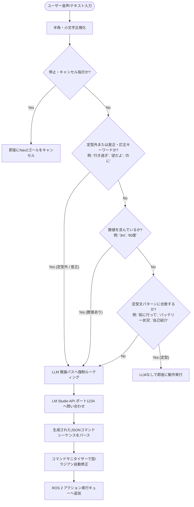

# Sirius LLM Dynamic Goal Node (`llm_dynamic_goal.py`)

`llm_dynamic_goal.py` は、ユーザーの自然言語による音声やテキスト指示をリアルタイムで解析し、ロボット（Sirius）の移動コマンド（ROS 2 アクションおよびトピック）へと変換するハイブリッド型のナビゲーションノードです。

---

## 💡 基本的な動作（LLMなしで動くか？）

**はい、シンプルな定型指示であれば LLM (LM Studio) なしで完全に動作します。**

本ノードは**「ルールベースの高速パス (Rule-Based Fast Path)」**と**「LLM（Llama3等）による深層推論パス」**を融合したハイブリッド構成になっています。

### 1. LLMなしで即座に動作するコマンド（高速パス）
指示文に**数値（数字や「一」「度」など）を含まず、是正要求でもない**シンプルな以下のパターンは、Pythonの正規表現・文字列マッチングだけで即座に実行されます（LLMのAPIサーバーが落ちていても動作します）。

* **移動コマンド (標準値で動作)**:
  * 前進: `「前に行って」` `「進んで」` `「まえ」` など（1.5m前進、少し/ちょっと＝1.0m前進）
  * 後退: `「下がって」` `「うしろ」` `「バック」` など（1.0m後退）
  * 相対旋回: `「右向いて」` `「左向いて」` など（90度旋回、少し/ちょっと＝30度旋回）
  * その場旋回: `「その場で旋回」` `「回転して」` など（360度回転）
* **速度調整**:
  * `「ゆっくり」`（低速 0.2m/s） / `「ふつう」`（中速 0.9m/s） / `「急いで」`（高速 1.0m/s）
* **停止・キャンセル**:
  * `「ストップ」` `「止まれ」` `「停止」` `「キャンセル」` など
* **雑談応答・ステータス（事前登録ワード）**:
  * `「バッテリー状況」`（gRPC経由で顔アプリから電池残量を取得して発話）
  * `「自己紹介」` `「研究室紹介」` `「ウインク」` など（[chat.py](file:///home/kotantu-desktop/sirius_jazzy_ws/src/sirius/sirius_navigation/sirius_navigation/dialogue/chat.py) に定義されている応答テンプレートにマッチする会話）

---

## 🤖 LLM (LM Studio) を必要とする機能

以下のケースでは、LM Studio（ポート `1234`）のローカルAPIへ問い合わせを行い、LLMによる状況判断とコマンド生成を実行します。

### 1. 数値の指定がある場合
* 例: `「3m前に行って、そこで右に90度回って」`
  * 距離の単位（m、センチメートル）や、角度（度、回転）をパースし、複数の連続コマンド（例: `forward 3.0` ➔ `turn -1.5708`）に展開する処理はLLMが動的に担当します。

### 2. ユーザーによる「是正・訂正」が発生した場合
ユーザーが「行き過ぎ」「逆だよ」「まわりすぎ」「足りない」などの是正ワードを発話した際、ロボットは**直前に実行した動作の履歴と現在の自己位置（TF）から、反対方向への打ち消し移動（是正動作）をLLMで自動計算**します。
* **旋回過多の是正**: 前回の旋回動作の後に「行き過ぎ」と言われた場合、並進（後退）するのではなく、反対方向に少し戻る旋回コマンドをLLMが再計算します。

### 3. ロボットの状態やエラーに関する質問
* 例: `「なんで失敗したの？」` `「今の状況は？」` `「どのくらい回ったの？」`
  * ノードが保持する `Current Robot Pose`（現在の座標とYaw角）や、`Last Action Status`（直前のアクションの成否・誤差・実際に動いた実績量）をLLMのプロンプト（コンテキスト）に流し込み、ロボット自身が日本語の発話テキスト（`speak` フィールド）を動的に作成して説明します。

### 4. その他複雑な会話や範囲外の対話
* 例: `「今日の天気は？」`
  * コマンドは生成せず（`"commands": []`）、LLMがナビゲーションアシスタントとして自然な話し言葉で応答します。

---

## 🛠️ 安全・自動補正機能 (Pythonサニタイザー)

LLMの出力揺れによるロボットの誤作動を防ぐため、Python側で強力な**コマンドサニタイザー**が常時作動しています。
* **`face` と `turn` の取り違え補正**: LLMが「右向いて」などの相対方向に対して、誤って絶対方位コマンド（`face`）をラジアン値で出力した場合、自動で相対旋回（`turn`）へと書き換えます。
* **単位補正**: `"turn"` コマンドが大きな値（度数法）で出力された場合は自動的にラジアンへ変換し、逆に `"spin"` コマンドが小さな浮動小数点（ラジアン）で出力された場合は度数法へと相互変換します。

---

## 📂 セリフテンプレートの集中管理

対話時の音声セリフテンプレートは重複定義を防ぎ保守性を高めるため、以下の役割分担で一元管理されています。
* [navigation.py](file:///home/kotantu-desktop/sirius_jazzy_ws/src/sirius/sirius_navigation/sirius_navigation/dialogue/navigation.py): 移動（前進、後退、旋回、スタック、目的地到着など）に関するテンプレート
* [system.py](file:///home/kotantu-desktop/sirius_jazzy_ws/src/sirius/sirius_navigation/sirius_navigation/dialogue/system.py): システム状態（バッテリー報告、速度設定変更など）に関するテンプレート
* [__init__.py](file:///home/kotantu-desktop/sirius_jazzy_ws/src/sirius/sirius_navigation/sirius_navigation/dialogue/__init__.py) / [local_parser.py](file:///home/kotantu-desktop/sirius_jazzy_ws/src/sirius/sirius_navigation/sirius_navigation/dialogue/local_parser.py): 上記テンプレートを動的にインポート・マージして単一の `DIALOGUE_TEMPLATES` ディショナリとして公開・利用します。

