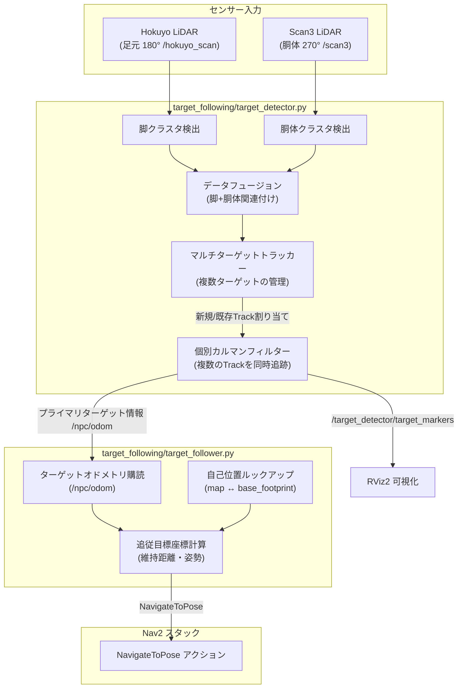

# Sirius Navigation - ターゲット追跡・追従システム (Target Tracking & Following System)

本システムは、LiDAR（2Dレーザースキャン）データから特定のターゲット（人間・NPCなど）をリアルタイムに検出し、一定の距離を保ちながら自動で追従（フォロー）するための機能を提供します。

---

## システム構成

本システムは、**検出ノード (`target_detector`)** と **追従ノード (`target_follower`)** の2つのROS 2ノードから構成されており、これらは管理しやすいように専用のサブパッケージフォルダ `sirius_navigation/target_following/` にまとめられています。



---

## 1. 複数ターゲット検出・追跡ノード (`target_detector.py`)

足元の LiDAR（脚）と腰の高さの LiDAR（胴体）のデータを統合（フュージョン）し、**複数のターゲット（周囲にいるすべての人型オブジェクト）をマルチターゲット・トラッキング (MTT)** します。

### トラッキングアルゴリズムの仕組み

1. **個別トラック管理 (`Track`クラス)**:
   検出されたすべてのターゲットは、個別の ID、位置・速度状態（カルマンフィルター）、共分散、およびサイズ特徴量を保持する `Track` インスタンスとして管理されます。
2. **ハンガリアン法による最適データ関連付け**:
   貪欲法（Greedy）に代わり、**scipyのハンガリアン法（線形割当問題のグローバル最適化: `linear_sum_assignment`）**を導入しています。すべてのアクティブなトラックと検出点との間のマッチングにおいて、全体としての移動・特徴量の差の総コストが最小になるような組み合わせを一括で解きます。これにより、近接時のターゲット交差耐性が劇的に向上しました。
3. **移動方向（速度ベクトル）の一貫性チェック**:
   トラックが一定以上の速度（`> 0.15 m/s`）で移動している場合、新たな検出点への移動方向が現在の進行方向と逆向きになるような無理のある紐付けに対して、**方向ペナルティ（最大 `+2.4`）**を自動で加算します。これにより、交差した際に入れ替わり（乗っ取り）が発生するのを防ぎます。
4. **静的障害物（柱やゴミ箱など）の自動除外アルゴリズム (NEW)**:
   人間以外の動かない障害物（テーブルの脚、柱、ゴミ箱など）への誤ロックオンや吸い付きを防ぐため、**初期位置からの最大変位（移動距離）を監視するフィルタリング機能**を実装しています。
   * **初期猶予時間**: ターゲットが新規検出された最初の 40 フレーム（約 4 秒間）は、立ち止まったままでも「動的ターゲット」として仮登録され、ロボットの前に立つだけで **即座に（約0.6秒で）ロックオン可能** です。
   * **静止判定**: 40 フレーム以上経過しても初期位置からの最大移動距離が **`0.25m` 未満** の場合、そのターゲットは「静的オブジェクト（`is_static = True`）」と判定されます。
   * **ロックオン自動解除・除外**: 静的オブジェクトに判定されたターゲットは、追従対象（プライマリターゲット）の選定から除外されます。また、追従中のターゲットが途中で静止判定された場合、ロボットは自動的にロックオンを解除します。
   * **動的復帰**: 静止判定されたターゲットであっても、動き出して初期位置から **`0.25m` 以上移動** したことを検知すると、即座に静止フラグが解除され、通常の追従対象に戻ります。
5. **新規ターゲット登録**:
   どの既存トラックにも関連付けられなかった検出候補が、ロボット前方のロックオンエリア（前方1.2m、左右±30cm）内で検知され、数フレーム安定して検出された場合、新しいユニークIDを持つ新規トラックとして登録されます。
6. **プライマリターゲット（追従対象）の選定**:
   * ロボットが追従して移動するための「プライマリターゲット（`/npc/odom` へ配信）」は、ロックオンされたトラックから選ばれます。
   * 現在のプライマリターゲットがロストした場合、**自動的に現在検知されている中で最も近い他のアクティブなトラックに引き継がれ**、誰もいない場合のみキャリブレーション待ちに戻ります。

### 主要パラメータ (`params/` 内で設定可能)

| パラメータ名 | デフォルト値 | 説明 |
| :--- | :--- | :--- |
| `lockon_max_range` | **`1.2m`** | キャリブレーション時に新規ロックオンを受け入れる前方の最大距離。 |
| `lockon_max_lateral` | **`0.3m`** | キャリブレーション時に受け入れる左右の最大ズレ幅（±30cm、ロボット正面に限定）。 |
| `active_max_range` | **`10.0m`** | 追従中の最大検出距離（一度ロックオンすれば10m離れても追跡を維持）。 |
| `min_leg_width` | **`0.07m`** | 脚検出用の最小幅（7cm）。150cmNPCの最小脚径に対応。 |
| `max_leg_width` | **`0.20m`** | 脚検出用の最大幅（20cm）。175cmNPCの最大脚径に対応。 |
| `min_torso_width` | **`0.15m`** | 胴体検出用の最小幅（15cm）。150cmNPCが横を向いた際の厚みに対応。 |
| `max_torso_width` | **`0.55m`** | 胴体検出用の最大幅（55cm）。175cmNPCの最大肩幅に対応。 |
| `gating_distance` | **`0.6m`** | 追従中のカルマンフィルター関連付けゲート。静的オブジェクト（柱など）への吸い付きを防止。 |
| `active_fov_deg` | **`270.0`** | 追従中の有効視野角。270度に広げることで、ロボットの真横や斜め後方の回り込みに対応。 |

---

## 2. ターゲット追従ノード (`target_follower.py`)

検出ノードが選定したプライマリターゲットのオドメトリ情報（`/npc/odom`）を元に、ロボットが一定の距離を維持して追尾するためのゴール指令を Nav2 に送信します。

### 主要パラメータ

| パラメータ名 | デフォルト値 | 説明 |
| :--- | :--- | :--- |
| `follow_distance` | `0.8m` | ターゲットとロボットが維持する目標距離。 |
| `deadband` | `0.1m` | 停止判定用の不感帯（維持距離±10cm）。これより近づいた場合は自動停止。 |
| `min_update_distance` | `0.15m` | ターゲットがこの距離以上移動した場合のみゴールを更新。 |

---

## Unity側シミュレーション上のカスタム設定

複数NPCが存在する環境において、以下の制御スクリプトがNPCPrefabまたはGameObjectに適用され、ROSとの親和性を担保しています。
1. **身長・体型のバリエーションと実寸化 (`NPCProceduralAnimator.cs`)**:
   * 生成時に自動でプレハブの基準スケールをリセットし、実寸大（メートル単位）でスケールします。
   * 身長は日本人の平均的な分布に合わせ、**150cm、165cm、175cm** の3つにランダムに振り分けられます。
   * 胴体は人間らしく X軸方向（肩幅）が広く Z軸方向（厚み）が薄い**楕円柱**として生成されます。
   * 身長（スケール）に比例して、NavMeshAgentの移動速度も自動でスケーリング（平均 1.3m/s 付近、±0.2m/s のばらつき）され、脚の振り速度（歩行アニメーション）も速度に合わせて滑らかに連動します。
   * `NavMeshAgent`の回転を手動制御し、常に実際の移動ベクトル方向（`agent.velocity`）へ滑らかに向きを合わせることで、横滑りのないリアルな歩行を実現しています。
2. **個別マニュアル操作の制限とハイライト (`NPCManualController.cs`)**:
   * 操作を受け付けるのは名前が `"NPC_0"` のNPCのみに制限されます。それ以外の複製されたクローンNPCは操作トピック購読スクリプトを自己破壊して競合を防ぎます。
   * 操作対象の `NPC_0` は、開始時にマテリアルカラーが自動で**赤色**に変更され、視覚的に目立ちます。
3. **真値パブリッシャーの競合防止 (`GroundTruthPublisher.cs`)**:
   * `"NPC_0"` 以外のNPCはオドメトリ真値トピックへの送信を無効化（スクリプト自己破壊）します。これにより、複数NPC出現時にも `odom_gt` の値が飛び飛びになるのを防ぎます。

---

## 起動とRViz2での可視化

ナビゲーションスタックが立ち上がっている状態で、一括起動スクリプトを実行してください。

```bash
# 1. ワークスペースのセットアップ
cd ~/sirius_jazzy_ws
source install/setup.bash

# 2. 追従制御メニューの起動
./bash/startup_bash/target_follow.sh
```

### RViz2での確認
* トラッキングされている全ての人型オブジェクトは、トピック `/target_detector/target_markers` (MarkerArray) として配信されます。
* RViz2に「MarkerArray」ディスプレイを追加し、トピックに `/target_detector/target_markers` を設定します。
  - **水色・オレンジのシリンダー & `ID/FOLLOW ID`テキスト**: アクティブに追従・フィルタリングされている追跡対象（Track）。
  - **平面円（namespace: `raw_detections`、直径0.4m）**: 胴体検知されたすべての生データ。
    - **オレンジ色**: 胴体と脚が両方検出されており、確信度が高い候補。
    - **黄色**: 胴体のみ検出（足元が隠れているなど）、確信度が低い候補。
